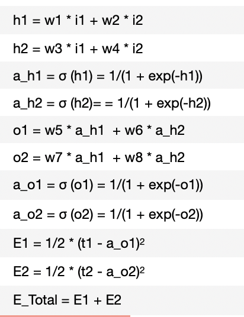
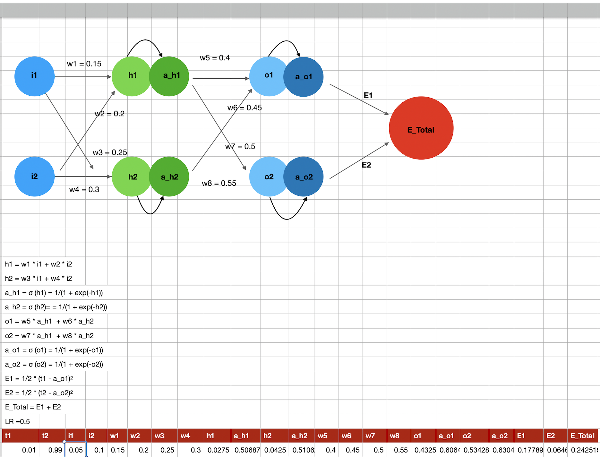
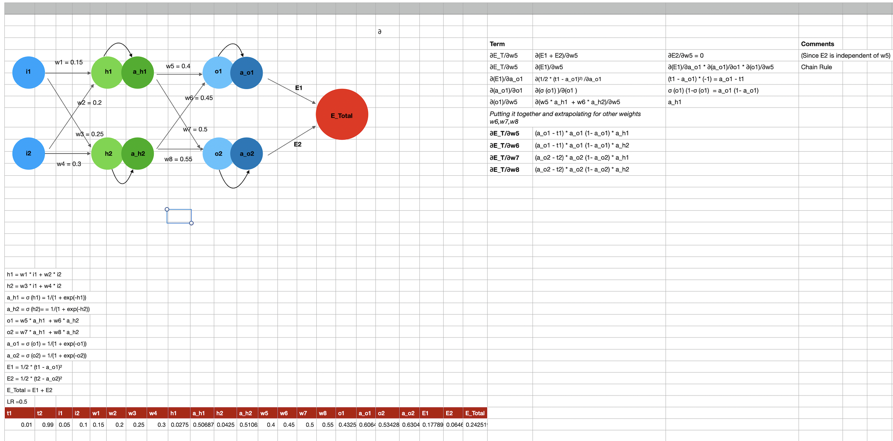
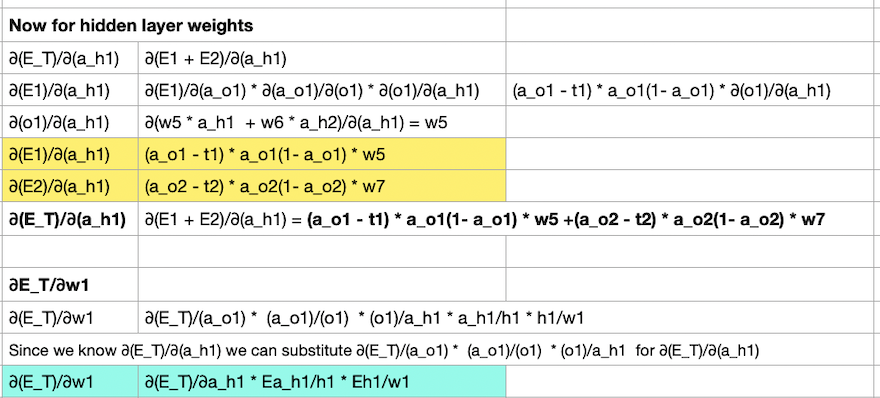

# end2-nlp-pavithra

### Session 1 - Basics
##### What is a neural network neuron?

A DNN or Neural network neuron is a storage unit that stores a number or a "signal". Our neurons in our brain in addition to having a storage unit, also have their own computation unit. A neural network neuron has the computation unit outside it along with a weight (a number) for each neuron. A NN neuron stores the result of the computation of its input based on the weight and the activation function

$$ z (neuron_a) =  \text{Activation function} * (\text {input from the input connection} * \text{weight of the neuron}) + bias)$$

The output of a $ neuron_a $ serves as an input for the $ neuron_b $ in the next layer. The two neurons $ neuron_a \text{and } neuron_b $ are connected by the outgoing connection from $ neuron_a$

##### What is the use of the learning rate?

In gradient descent, the learning rate handles magnitude with which a weight changes according to the loss value of the NN. While a gradient sets the direction in which the NN weights are decreasing wrto the loss value, such that local loss minima is achieved, the learning rate ensures the smooth convergence of the loss optimization at a steady rate.Larger learning rate might lead to losing the local minima and will not lead to gradual reduction in ths loss, thereby hindering convergence (loss reduction as it approaches a local minima)

##### How are weights initialized?

Weights are initialized based on Gaussian or normal distribution (random-normal)  with zero-mean and a calculated variance (smaller weights). The intuition behind the generalization of a NN is about learning from the input distribution. The weights should follow a normal distribution (or something similar) such that as it learns during the training it is able to converge better. The scale of the initial weight distribution affects the convergence of the network. The smaller the scale, better the convergence.

Using weights as constant values hinders convergence mainly because of vanishing/exploding gradients. 

##### What is "loss" in a neural network?

The difference between the NN output and the ground truth output. The loss function determines the learning (training) outcome in a NN. A loss function shows the NN the gaps that it needs to fill/learn, such that it is able to perform a particular task.

##### What is the "chain rule" in gradient flow?

Chain rule helps in find the partial derivative of a function A  with respect to another function B, by using a function C

Chain rule helps in propagating the loss value from one layer to another such that a given NN's weight is changed wrto to the loss value

Source: https://medium.com/@pavisj/convolutions-and-backpropagations-46026a8f5d2c

### Session 2
#### Excelling in Backpropagations in Excel 
*(contextualized pun intended)*

We will be "training" a neural network in Excel, as an exercise for understanding Backpropagation. Here is the complete picture of a NN trained for 45 epochs with a Learning rate of 0.5

Read on to know how this was done. The excel sheet: https://github.com/pavisj/end2-nlp-pavithra/blob/main/session2-backpropagation.xlsx

**Step 1: Creating the NN**
Create the Neural network with the 8 weights - w1 to w8. Consider this to be a binary classification task, which takes two inputs i1 and i2 and gives two outputs o1 and o2. L2 loss is used for defining the loss. Sigmoid is the activation function used. The target values for the outputs t1 = 0.01 and t2 = 0.99, as shown in the screenshots below. 

**Step 2: Forward Pass**
Write the formulae for the forward pass of the Neural network.

**Step 3: Forward Pass values**
Write all the input and output variables along with the weights, hidden layer neurons as well as their activations. Using the formulae from Step 2 calculate the values for forward pass

**Step 4: Backpropagation: Finding Derivatives of weights**
Let us start the backpropagation. The objective of backpropagation here is to find the derivative of the loss with respect to the weights w1 to w8. 

We start with calculating the derivatives with respect to the weights from the last layer that generates the outputs o1 and o2

$∂E_T/∂w5$
$∂E_T/∂w6$
$∂E_T/∂w7$
$∂E_T/∂w8$

When calculating backpropagation derivatives, we use the chain rule which was been described above. Let us apply the chain rule for calculating $∂E\_T/∂w5$

$∂E\_T/∂w5=	∂(E1 + E2)/∂w5 $
$∂(E2)/∂w5 = 0 $ since E2 is independent of w5

$$∂(E1)/∂w5=	∂(E1)/∂a\_o1 * ∂(a\_o1)/∂o1 * ∂(o1)/∂w5$$

Finding the respective derivatives:

$(\frac {∂(E1)}{∂a_o1}) = ∂(1/2 * (t1 - a\_o1)^2) /∂a_o1 =	(t1 - a\_o1) * (-1) = a\_o1 - t1$

$∂(a\_o1)/∂o1 = ∂(σ(o1))/∂(o1) = σ(o1)(1-σ(o1) = a\_o1 (1- a\_o1)$

$∂(o1)/∂w5=∂(w5 * a\_h1  + w6 * a\_h2)/∂w5=a\_h1$

Putting it together:

$$∂E\_T/∂w5=(a\_o1 - t1) * a\_o1 * (1-a\_o1) * a\_h1 $$

Extrapolating for other weights $∂E_T/∂w6 ,$ $∂E_T/∂w7,$ and $∂E_T/∂w8$, as shown in the image below

**Step 5: Calculating Hidden Layer activation derivatives for chain rule** 
Now that we have derivatives for w5, w6, w7 and w8. Let us look at how we can find the $∂E\_T/∂w1$

Using chain rule, 

$$
∂(E\_T)/∂w1 = ∂(E\_T)/∂(a\_o1) * ∂(a\_o1)/∂(o1) * ∂(o1)/∂(a\_h1) * ∂(a\_h1)/∂h1 *∂h1/∂w1
$$

or it can also be written as

$$
∂(E\_T)/∂w1 = \textbf{∂(E\_T)/∂a\_h1} * ∂a\_h1/∂h1 * ∂h1/∂w1
$$

We have to calculate the first term in the above equation $∂(E\_T)/∂a\_h1$ 

$$∂(E\_T)/∂a\_h1  = ∂(E1 + E2)/∂(a\_h1) =  ∂(E1)/∂(a\_h1) + ∂(E2)/∂(a\_h1)$$

We need to calculate it in terms of E1 and E2, which is shown below

**Step 6: Calculating Derivatives for w1 to w4**

Using the $∂(E\_T)/∂a\_h1$, we can calculate $∂(E\_T)/∂w1$. Also using the $∂(E\_T)/∂a\_h1$, we can extrapolate for $∂(E\_T)/∂a\_h2$

And we are able to extrapolate for weights  - w2, w3 and w4 (using $∂(E\_T)/∂w1$)

**Step 7: Calculating values for Backpropagation**

Calculating derivatives for w1 to w8. Do it for w5 to w8, first and then w1 to w4 

**Step 8: Updating the weights with Learning Rate as 0.5**

**Step 9:The first epoch**

**Step 10: And the magic of training a NN with drag and drop**

As we drag down, we can see the NN training with LR as 0.5 and E_total reducing

**Using different learning rates**

The learning rate (LR) increases from 0.1 to 2.0., we see that convergence gets better and we are able to reach lower losses sooner. At LR=0.1, the loss is at 0.1853 after 45 epochs. With LR = 0.5, at 45 epochs it is at 0.0703. With LR=2.0, the loss curve gets steeper and loss is at 0.0139 after 45 epochs. 

**0.1**

**0.2**

**0.5**

**0.8**

**1.0**

**2.0**

