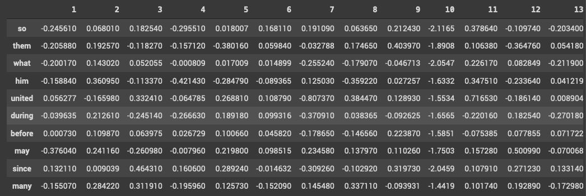
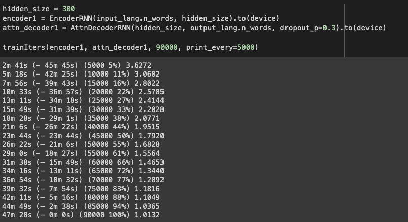
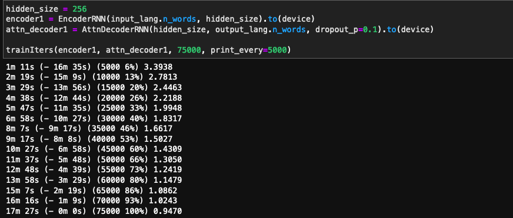

## Session 10 - Seq2Seq Attention Networks ##

Submitted as a **group assignment** by 
- Smruthi SR
- Debashish Sarangi
- Pavithra Solai
- Anirban Mukherjee

**Objective:** Creating a Seq2Seq model with attention for English to French Translation using GloVe Embedding. We will also be looking at how we process the data as well as use GloVe Embeddings for creating nn.embedding lookup table. We will also discuss how the model performs as compared to a model without GloVe embeddings 

### Creating Dataset using TorchText from Scratch ###

We will have to define custom pre-process functions inorder to build a vocab from the original data 

This is done in the following way:

1. Defining the Lang Classes

	Two language classes are used one for input language and another one for a output language. 
	Input language class is used to process the source language i.e English in our case and takes number of words from Glove embbedings
	Output language class is used to process the target language i.e French in our case and takes number of words from raw data 
	Note that, for output language we can not use Glove embbedings as it does't support French language

	```
	class InputLang:
		def __init__(self, name):
			self.name = name
			self.word2index = { k : v for k , v in sorted(word2idx.items(), key=operator.itemgetter(1))}
			self.word2count = { word : 1 for word in words }
			self.index2word = { i : word for word, i in word2idx.items() }
			self.n_words = 400001
		def addSentence(self, sentence):
			for word in sentence.split(' '):
				self.addWord(word)
		def addWord(self, word):
			if word not in self.word2index:
				self.word2index[word] = self.n_words
				self.word2count[word] = 1
				self.index2word[self.n_words] = word
				self.n_words += 1
			else:
				self.word2count[word] += 1
	```
	In the above class addSentence function splits the sentence into words based on space. The addWord function keeps track of adding a new words, each words index and number of times a same word is repeated

	 
	```
	SOS_token = 0
	EOS_token = 1
	class OutputLang:
		def __init__(self, name):
			self.name = name
			self.word2index = {}
			self.word2count = {}
			self.index2word = {0: "sos", 1: "eos"}
			self.n_words = 2  # Count SOS and EOS
		def addSentence(self, sentence):
			for word in sentence.split(' '):
				self.addWord(word)
		def addWord(self, word):
			if word not in self.word2index:
				self.word2index[word] = self.n_words
				self.word2count[word] = 1
				self.index2word[self.n_words] = word
				self.n_words += 1
			else:
				self.word2count[word] += 1
	```
	The above class is almost similar to InputLang except the number of words are not taken from Glove and one more point to note that sos and eos tags are added explicitly 

2. Using unicode and normalize function

	```
	# Turn a Unicode string to plain ASCII, thanks to
	# http://stackoverflow.com/a/518232/2809427
	def unicodeToAscii(s):
		return ''.join(
			c for c in unicodedata.normalize('NFD', s)
			if unicodedata.category(c) != 'Mn'
		)
	# Lowercase, trim, and remove non-letter characters
	def normalizeString(s):
		s = unicodeToAscii(s.lower().strip())
		s = re.sub(r"([.!?])", r" \1", s)
		s = re.sub(r"[^a-zA-Z.!?]+", r" ", s)
		return s
		
	```
UnicodeToAscii function helps to convert unicode characters ASCII format and normalizeString function cleans the text by removing special characters

3. Extracting input and output language pairs from raw text 

```
	def readLangs(lang1, lang2, reverse=False):
		print("Reading lines...")

		# Read the file and split into lines
		lines = open('data/%s-%s.txt' % (lang1, lang2), encoding='utf-8').\
			read().strip().split('\n')

		# Split every line into pairs and normalize
		pairs = [[normalizeString(s) for s in l.split('\t')] for l in lines]
		#print(pairs[0])

		# Reverse pairs, make Lang instances
		if reverse:
			pairs = [list(reversed(p)) for p in pairs]
			input_lang = InputLang(lang2)
			output_lang = OutputLang(lang1)
		else:
			input_lang = InputLang(lang1)
			print(input_lang)
			output_lang = OutputLang(lang2)

		return input_lang, output_lang, pairs
```

The readLangs function takes source and target language as inputs and returns the input and output language pairs. ***reverse*** argument is set to true when machine translation has to be performed from French to English

4. Trimming the sentences based on filtering the length and content

```
	MAX_LENGTH = 10

	eng_prefixes = (
		"i am ", "i m ",
		"he is", "he s ",
		"she is", "she s ",
		"you are", "you re ",
		"we are", "we re ",
		"they are", "they re "
	)

	def filterPair(p,reverse):
      if(reverse):
        return len(p[0].split(' ')) < MAX_LENGTH and \
            len(p[1].split(' ')) < MAX_LENGTH and \
            p[1].startswith(eng_prefixes)
    else:
         return len(p[0].split(' ')) < MAX_LENGTH and \
        len(p[1].split(' ')) < MAX_LENGTH and \
        p[0].startswith(eng_prefixes)


	def filterPairs(pairs,reverse=False):
		return [pair for pair in pairs if filterPair(pair,reverse)]
``` 


5. Finally, making word lists from sentences in pairs

```
	def prepareData(lang1, lang2, reverse=False):
    input_lang, output_lang, pairs = readLangs(lang1, lang2, reverse)
    print("Read %s sentence pairs" % len(pairs))
    pairs = filterPairs(pairs,reverse)
    print("Trimmed to %s sentence pairs" % len(pairs))
    print("Counting words...")
    for pair in pairs:
        input_lang.addSentence(pair[0])
        output_lang.addSentence(pair[1])
    print("Counted words:")
    print(input_lang.name, input_lang.n_words)
    print(output_lang.name, output_lang.n_words)
    return input_lang, output_lang, pairs


	input_lang, output_lang, pairs = prepareData('eng', 'fra')
	print(random.choice(pairs))
```

The prepareData function brings all the previous functions in place and returns input, output language pairs

### Using GLoVe Embedding ###

For using GloVe embedding we need to use it for building our vocab which means the GloVe file glove.6b.300d.txt has to be processed first.

We tried using glove vectors from torchtext.vocab but it was not easily amenable to us so we directly loaded the GloVe file as shown in this [blog](https://leakyrelu.com/2019/10/18/using-glove-word-embeddings-with-seq2seq-encoder-decoder-in-pytorch/)

For this exercise, we will be using Glove 300D embeddings of 400k words from Wikipedia (https://nlp.stanford.edu/data/glove.6B.zip)

So our embedding size is 300 which will be used across the notebook

```
word2index[word] = index
index += 1
vect = np.array(line[1:]).astype(np.float)
vectors.append(vect)
```

In the above code snippet we assign a number to each word which is stored in a dictionary **word2index** and we store the corresponding vector of the word in the **vectors** list

<sos> and <eos> tokens will have 0 and 1 index and we swap the words at these locations to incorporate the sos and eos tokens

We also create a dictionary to store each word and its vector as a key-value pair

```
glove = {w: vectors[word2index[w]] for w in words_list}
```

Here is an example of words and their corresponding vectors 



Now that we have our Glove embeddings and their corresponding indices, let us build InputLang 

### A key insight: InputLang will be based on Glove Vocab and Input Vocab. OutputLang will be based only on the TargetLang

Also the nn.embedding table will have vectors from Glove for words that are present in Glove and for randomly intialized vectors for words not in Glove (OOV). We create our weights matrix by iterating through all the words in our input dataset and assigning embeddings accordingly

```
weights_matrix[i] = glove[word]
words_found += 1
(if not found):
weights_matrix[i] = np.random.normal(scale=0.6, size=(300, ))
```

Once this weight matrix is created, we convert it as a tensor and use it as pre-trained embedding using 
**nn.embedding.from_pretrained**

```
self.embedding = nn.Embedding.from_pretrained(torch.Tensor(weights_matrix), freeze=False)
```

freeze=false --> means that we will be fine-tuning the embeddings and hence the weights will be updated after every model.step() (after every backprop)

### Teacher Forcing ###

A few notes about Teacher Forcing which we have used in our model:

- Teacher forcing is a method of training seq2seq recurrent neural network models by using ground truth from a previous time step as input in the decoder.

- Teacher forcing adds stability to the model by supplying the ground truth for previous time step by which the prediction by decoder improves. Teacher forcing also helps models to train quickly or converge quickly.

- Teacher forcing works by using the actual output from the training dataset at the current time step X(t) as input in the next time step X(t+1) for the decoder, rather than the output generated by the model.

- Teacher forcing is used for Seq2seq models which is leveraged to solve problems like Machine translation,Text generation or Caption generation tasks.

**We have used a teacher forcing ratio as 0.5 in our model.**

Reference:-
https://machinelearningmastery.com/teacher-forcing-for-recurrent-neural-networks/

###  Model Traininga and Comparison ###

Since we are using a higher dimension of 300, we have also used a dropout of 0.3 in the Attention Decoder. The learning rate after some experimentation was set at 0.01 since higher LRs tend to increase loss. We also tried Adam vs SGD and saw SGD gave better convergence

Please check our notebook for reference: [English to French model trained on GloVe embedding](Session10_Assignment_Translation_using_Seq2Seq_and_Attention_using_glove_v3.ipynb)

We trained for 90k iterations 

Final loss after 
```
47m 28s (- 0m 0s) (90000 100%) 1.0132
```



To compare this with a model without GloVe embedding we have trained a model for English to French as given in this [notebook](Model-without-glove-training.ipynb)



**We tried training with different dimension of GloVe embeddings but it did not show any improvement for a model without GLoVe embedding**

It was quite interesting to note that GloVe embeddings when used in our previous exercises like SST dataset for sentiment classification seemed to perform well but not in the case for translation tasks. 

Our hypothesis is that this could be because: Though we use pretrained embeddings, they are not contextualized embeddings or the attention mechanism does not lend itself to train the embeddings to be more contextualized for a given pair of sentences


