# Sentiment Analysis Task for Stanford Sentiment Treebank Dataset

## Objective: 
We will be using SST-5 Dataset (from this http://nlp.stanford.edu/~socherr/stanfordSentimentTreebank.zip) to perform Sentiment Analysis across 5 labels (Very Negative, Negative, Neutral, Positive, Very Positive) for movie reviews from Rotten Tomatoes. This dataset was curated by Stanford and using mTurks it was annotated at a phrase level i.e. Each sentence is represented as a Parse-Tree breaking it down into phrases. Each phrase was then shown to an annotator who gace it a score from 0 to 25, using a slider. This was later normalized to 0 to 1.

*Please note that I have used PyTreeBank for getting the labels associated with the Sentences from Phrases. For Session 7 Assignment, I will be changing this to my own preprocessing functions.*

**This is an hands-on exercise to familiarize ourselves wth Data Augmentation techniques for Text in PyTorch**

## Data Augmentation

Before we start working on the SST-5 Dataset, let us look at the Tweets Dataset which we worked on in Session-4. Let us look at how we clean the tweets and apply the different Data augmentation techniques, along with a discussion about the said techniques. 

Please refer [Tweets Data Augmentaton](./Tweet_DataAugmentation.ipynb)

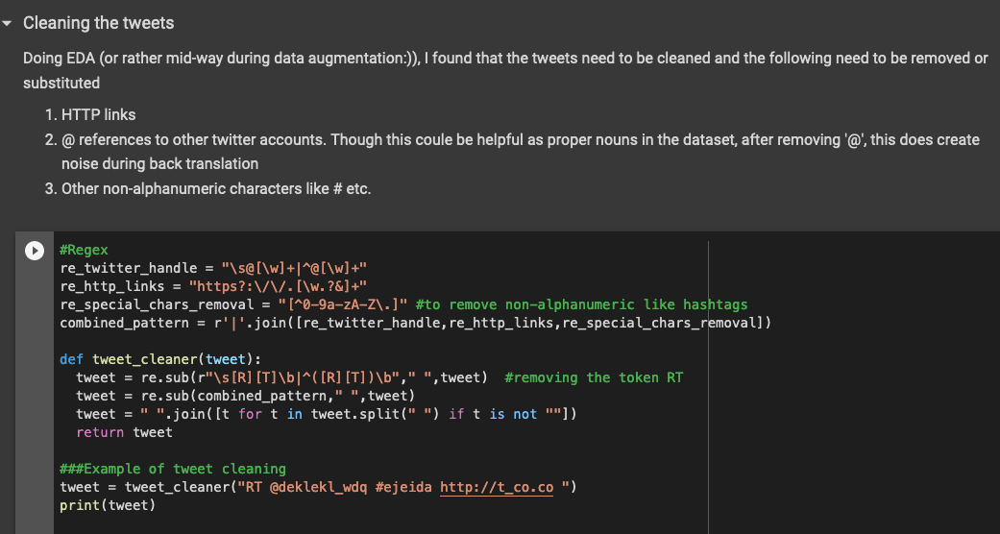

PyTorch - TorchText does not have an out-of-the-box pipeline for Text Data Augmentation. We will be following the text augmentation given in this [repo](https://github.com/jasonwei20/eda_nlp) (the corresponding Arxiv paper is given below). We will first augment the dataset and then use it for model training

As per the paper, *"EDA: Easy Data Augmentation Techniques for Boosting Performance on Text Classification Tasks"* - https://arxiv.org/pdf/1901.11196.pdf

1. **Synonym Replacement (SR)**: Randomly
choose n words from the sentence that are not
stop words. Replace each of these words with
one of its synonyms chosen at random.
2. **Random Insertion (RI)**: Find a random synonym of a random word in the sentence that is
not a stop word. Insert that synonym into a random position in the sentence. Do this n times.
3. **Random Swap (RS)**: Randomly choose two
words in the sentence and swap their positions.
Do this n times.
4. **Random Deletion (RD)**: Randomly remove
each word in the sentence with probability p

Along with this we will also be doing Back Translation, which has been explained in the next section.

### Augmenting Tweets Dataset
We will try the below augmentation techniques for the Tweets Dataset

1. **Random Swap**
2. **Random Deletion**
3. **Back Translate**

Later we will also look at  **Synonym Replacement (SR)** for SST-5 Dataset

1. **Random Swap**
   
   We take n(=5) pairs of words across the sentence and swap the position of the words.

2. **Random Deletion**
   
   Assign each word with a probability and if the probability is greater than 0.5, delete the words from the sentence

   Below is an example output of using Random Swap and Random Deletetion. Each group shows the tweet and the augmented tweets (RI, RD)

   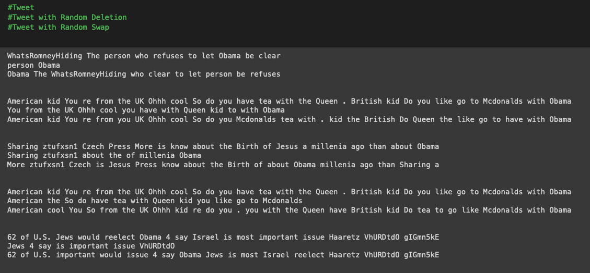

3. **Back Translation**

    Using a library called as google_trans_new which is a wrapper for the Google Translate API, we can do back translation as an augmentation.

    **Choose a random language (from available languages in Google Translate) --> Translate sentence from Engligh to that random language --> Translate the translated sentence back to English**

    Back Translation serves as an elegant way in which we get the same sentence phrased in different ways without changing the underlying semantics. Below is an example of back translated tweets. To be noted: Back Translation for SST-5 gave better results than that for Tweets. For Tweets, it would be better to remove hashtags and usernames before we back translate for better results.

    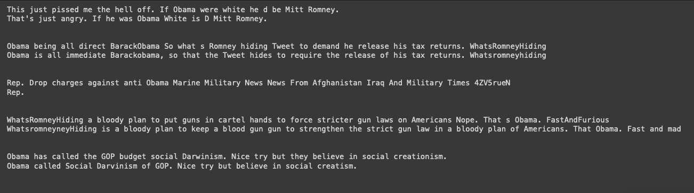

Using these augmented tweets, the Tweets Sentiment Analysis model has been retrained. Please refer [Tweets Sentiment Analysis Model using Augmented Tweets](Tweets_Sentiment_Analysis_using_LSTM_RNN.ipynb)

### Augmenting SST-5 Dataset

Please refer [SST-5 Data Augmentation](SST5_DataAugmentation.ipynb)

We have seen how Random Swap and Random Deletion works using Tweets Dataset. We will also be using it for SST-5. 

*Consideration: Data Augmentation should always mirror or be inspired from the underlying real-world distribution of data. Though techniques like Random Insertion and Deletion are interesting, we also need to to see if they diminish the context when it comes to shorter texts like Tweets or Sentences.*

After cleaning SST-5 dataset, we apply Synonym Replacement (1200), Random Swap (400) and Random Deletion (900) as Data Augmentation Techniques for 2500 sentences. 

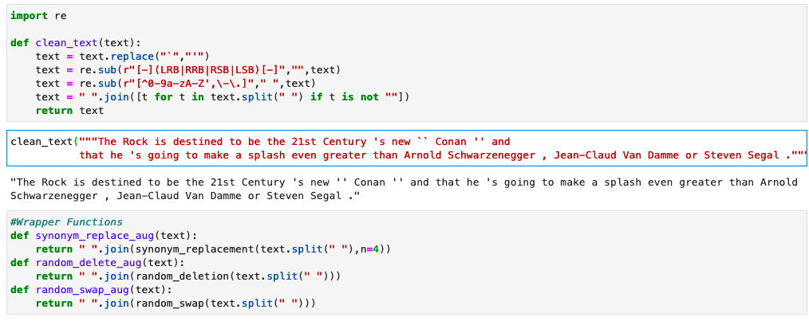

**Synonym Replacement**

For Synonym replacement we use WordNet to get the synonyms of words that are not stopwords. Here is an example of SR Augmentation

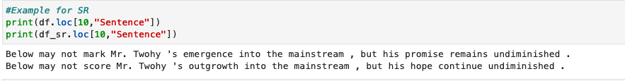

**Back Translation Using Google Sheets**

For Tweets, we only back translated close to 600 tweets. For SST-5, back translating around 3000 sentences was difficult. I tried a multiprocessing approach but the API shut me down since the number of requests were high

Here are some example of Back Translation for SST-5 
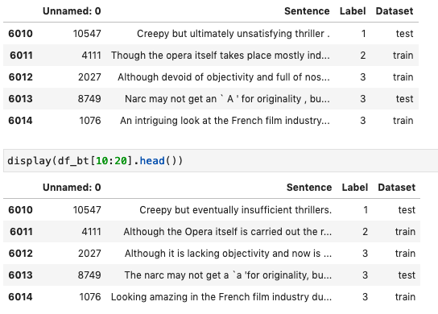

As suggested by Satyajit from END2, here is a Google Sheets template that can be used for Back Translation. Before we apply the translate function, we also generate a list of random languages which will act as the target language for back translation

 https://docs.google.com/spreadsheets/d/1N1yhQtGFAUm5k7XIlsZtOzrfsPZ7ZSDIUzOqHUXqoP8/edit?usp=sharing

After we apply augmentation to the Train dataset, here is the Test-Train split. We have done a 80-20 split for SST-5

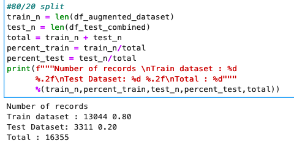

## Loading the custom dataset

Please refer [SST5 Model Training](SST5_ModelTraining.ipynb)

- We associate the data.Field and data.LabelField to Sentences and Sentiments. We use Spacy for tokenization of sentences.
- fields is a list of tuples that associate DataFrame columns to data.Field and data.LabelField
- data.Example shows how each record of the Dataset will be read from the DataFrames.
- We build the vocab based on the distinct number of non-repetitive Spacy tokens and store it in Pickle file
- We create BucketIterators such that it batches sentences of similar length with a batch size of 32.

## Model Architecture

- Using GLoVE embedding: We will be using GLoVe embeddings for better embeddings. We set the embedding lookup table weights to that of GLoVe's.

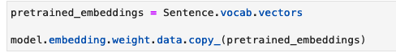

- This model has 5 stacked Bi-directional layers with a dropout of 0.65 between the layers. 

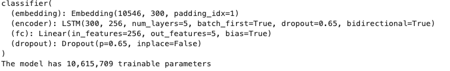

(IMO, this model is overparameterized)

## Training Log 

**The validation accuracy reached 42.69 but it did not increase further even after increasing the epochs**

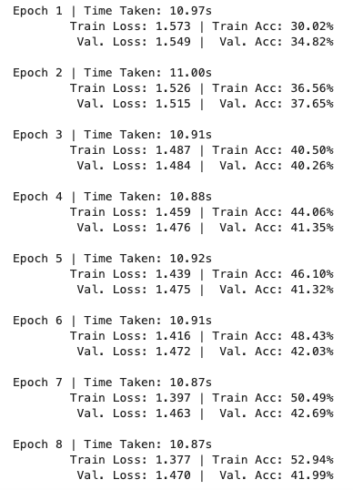

## Model Results

Here is an example of sentence sentiment classification

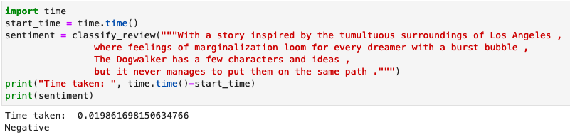

### Confusion Matrix

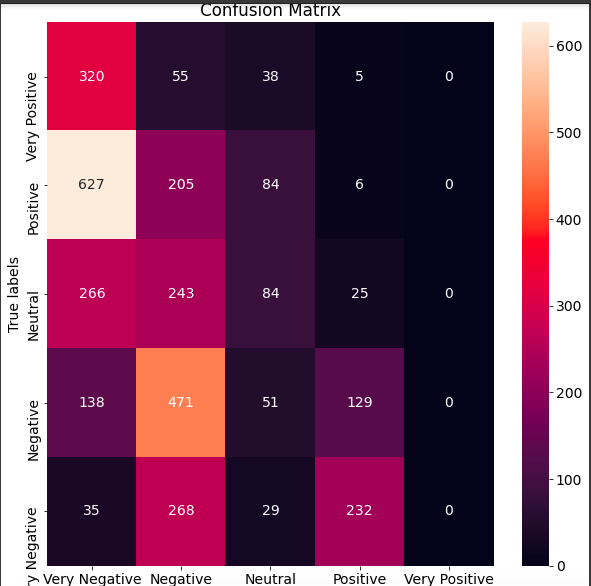

### Examples of correctly predicted sentences

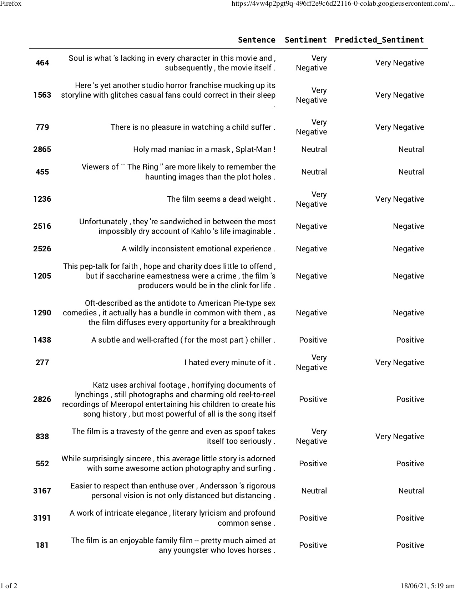
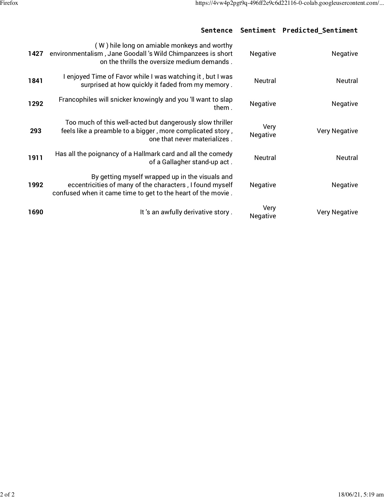

### False Positives

False Positives - When a sentence has a negative sentiment but the model predicts Positive or Neutral as the sentiment is a False Positive.

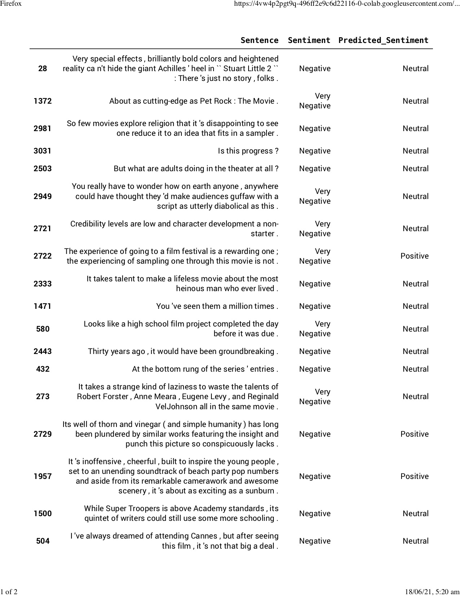