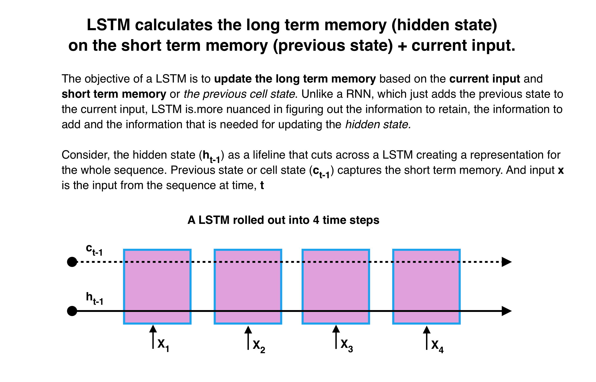
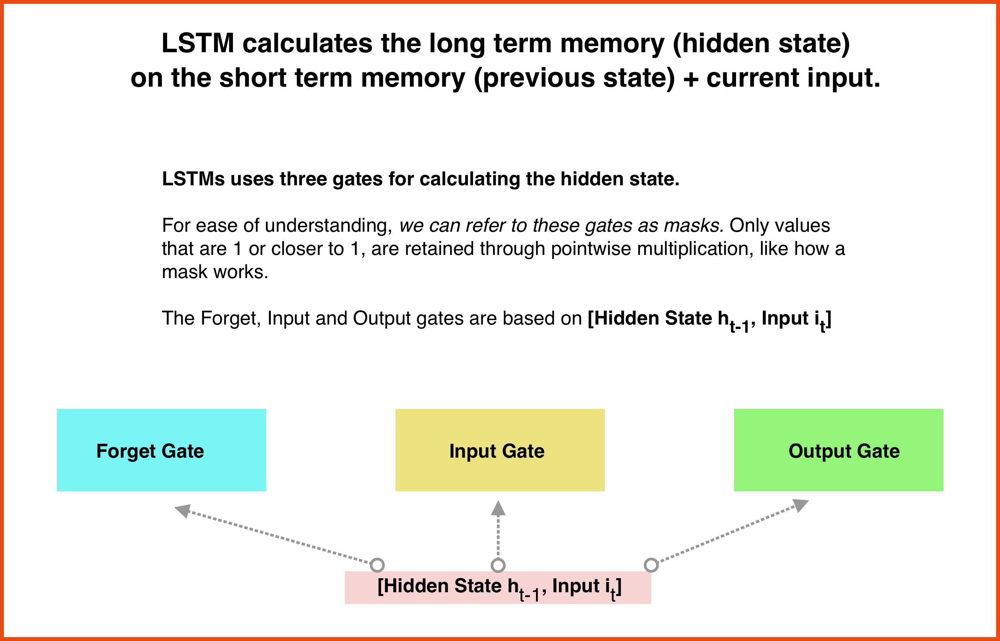
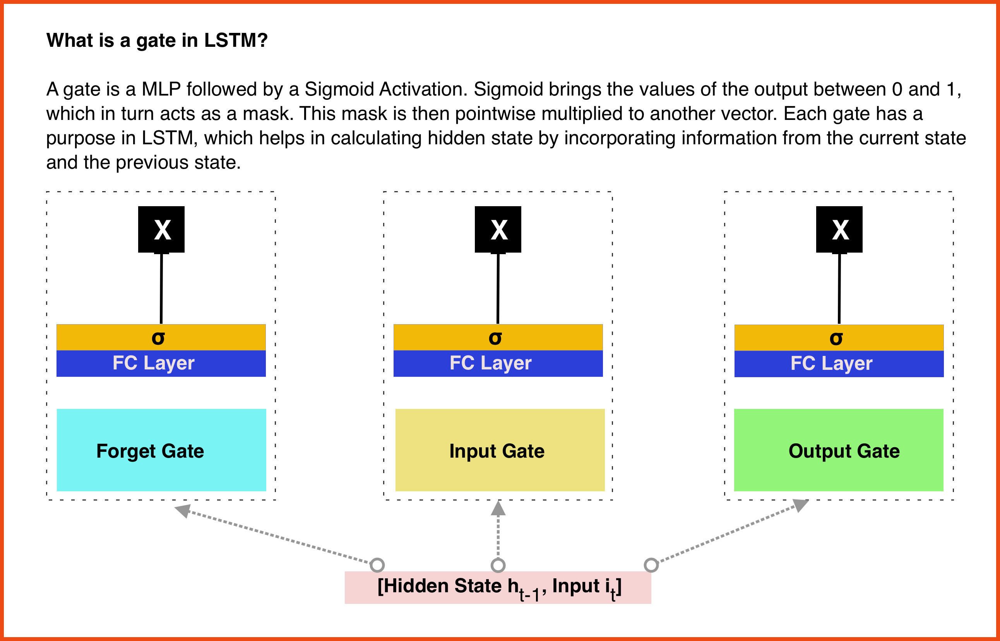
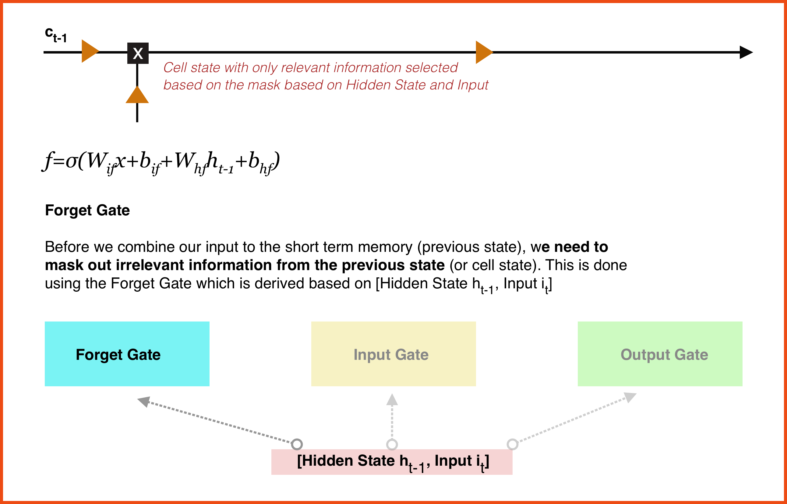
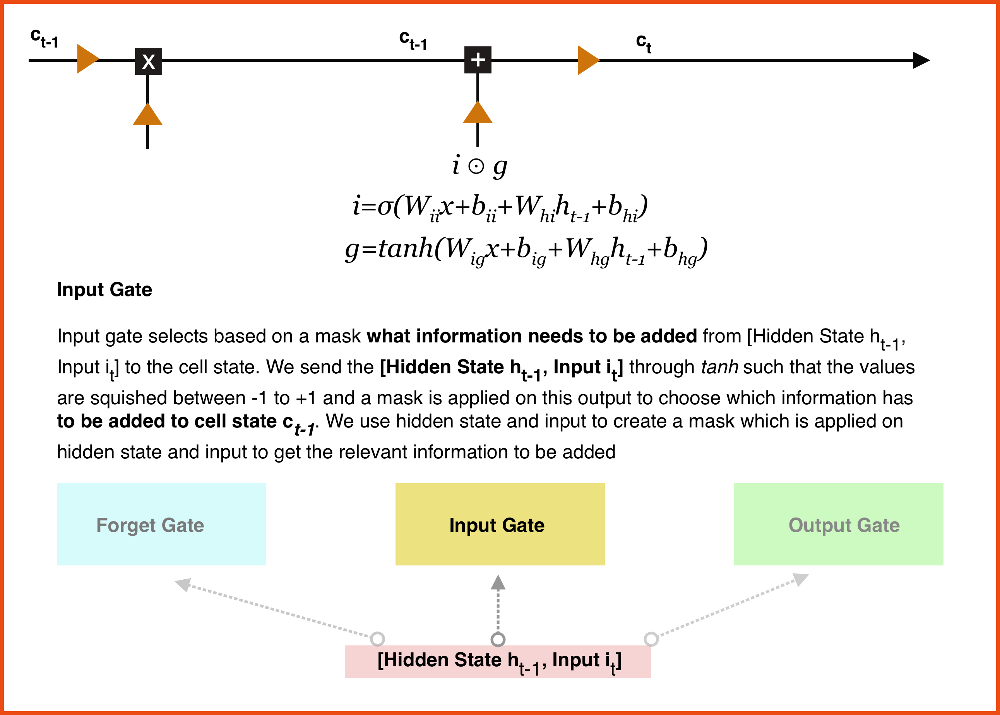
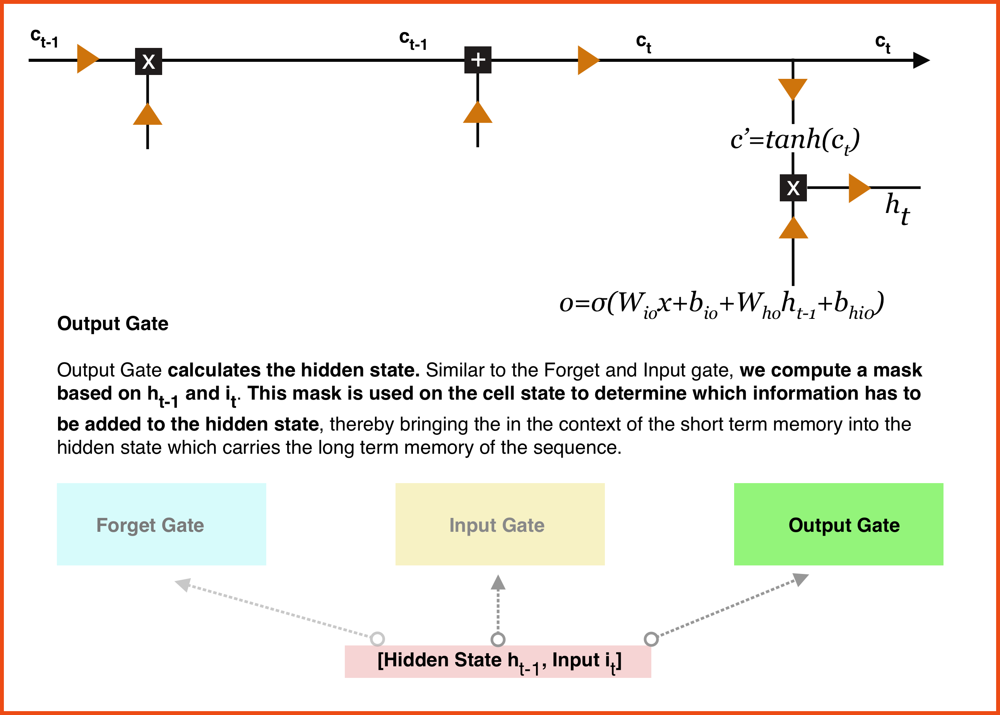
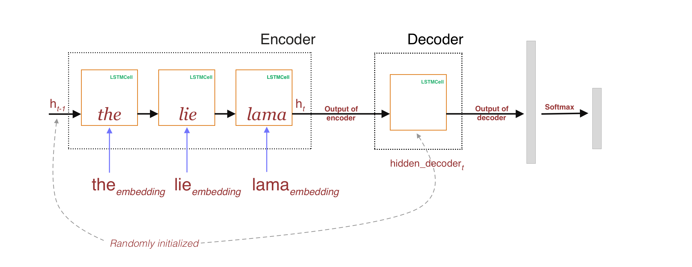
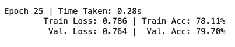

## Session 6: Creating a simple Encoder-Decoder

**Group Assignment:** \
Pavithra Solai\
Anirban Mukherjee\
Debashish Sarangi

### Task
Using Tweets as the dataset, perform sentiment analysis using an encoder and decoder architecture

**Colab Notebook:**
https://colab.research.google.com/drive/1nrU4Tl9-2DWja64r0fsRmAc27VfbVagN?usp=sharing

### A Quick Primer on LSTM

 

### Creating a custom Pytorch Dataset and Building the vocab
- We first associate the data.Field and data.LabelField to Tweets and Labels
- We use Spacy for tokenization
- fields is a list of tuples that maps the DataFrame (Dataset dataframe) columns to data.Field and data.LabelField

We build the vocab based on the distinct number of non-repetitive tokens and store it in Pickle files
Later we create BucketIterators for Train and Validation Datasets

### Model Architecture

Here we use a multi-step LSTM cell (https://pytorch.org/docs/stable/generated/torch.nn.LSTMCell.html) to simulate a encoder that reads words from a sentence one by one and create feature-rich embedding (h_t) which is set to a single-step LSTM cell that acts as a decoder. 

Using the Decoder's outputs, we send it to a Fully connected layer and then to softmax followed by Cross Entropy loss

**Points to Note**
1. The embedding tensor has all the embeddings of the tokens in a sentence for a given a batch of sentences
2. We iterate over each token embedding and send it to a LSTM cell. i.e. For a batch of 32 sentences, we send the 1st token of all the 32 sentences, use the hidden layer (h_1) output from that step and feed the 2nd word along with (h_1) and so on and so forth
3. When we start with the first token, the hidden and cell state have to be randomly initialized.
4. This is done for both Encoder and Decoder
5. For Decoder, we need to set a hidden layer dimension and in my case, we have used 150 for hidden_dim for Decoder

### Model Training

The model is trained for 25 epochs with validation accuracy of 79.7%
  

### Hidden State Outputs

For the sentence "A valid explanation for why Trump won't let women on the golf course." for which the sentiment is classified as Negative, here are the encoder and decoder outputs at every step

Length of the sentence :  15

Feeding word 1 of the sentence with length 15 

Hidden state -- h_1 -- for batch size of 1: 

tensor([[ 0.22, -0.55, -0.15, -0.35, -0.05, -0.13,  0.15,  0.19, -0.09,  0.50, -0.20, -0.31,  0.37, -0.38, -0.40, -0.20,  0.31, -0.45,  0.18,  0.07,
          0.36, -0.68,  0.47,  0.36, -0.03,  0.26, -0.46,  0.37, -0.26, -0.42,  0.26,  0.04,  0.02,  0.18,  0.09,  0.02,  0.20, -0.09,  0.16, -0.03,
          0.36, -0.07, -0.00, -0.36, -0.36, -0.06, -0.14, -0.21, -0.02, -0.12,  0.50, -0.16,  0.03, -0.03,  0.02, -0.19, -0.06,  0.01, -0.02, -0.09,
         -0.17, -0.45, -0.16, -0.05,  0.13,  0.27,  0.45, -0.07,  0.08,  0.03, -0.12,  0.01,  0.16, -0.09,  0.17, -0.15, -0.46,  0.05, -0.12, -0.23,
          0.25,  0.46, -0.27,  0.35, -0.02, -0.04, -0.03, -0.05,  0.06,  0.09, -0.10, -0.52,  0.04,  0.53, -0.25,  0.45,  0.04, -0.04,  0.20,  0.01]],
       device='cuda:0', grad_fn=<ThnnFusedLstmCellBackward>) torch.Size([1, 100])

Feeding word 2 of the sentence with length 15 

Hidden state -- h_2 -- for batch size of 1: 

tensor([[ 0.67, -0.76, -0.64, -0.79, -0.76, -0.20,  0.64,  0.79, -0.67,  0.08, -0.42,  0.14,  0.65,  0.36, -0.63, -0.55, -0.09, -0.84,  0.58, -0.26,
         -0.32, -0.84,  0.32,  0.68, -0.58,  0.59, -0.76,  0.67, -0.36,  0.08,  0.56, -0.50,  0.57,  0.74,  0.14, -0.10, -0.41,  0.55,  0.60, -0.28,
          0.10, -0.05, -0.23,  0.27, -0.18,  0.34, -0.01, -0.64,  0.39, -0.70,  0.07,  0.27, -0.54,  0.44, -0.52, -0.61, -0.05,  0.54, -0.34, -0.63,
         -0.66, -0.55,  0.38,  0.16,  0.01,  0.66, -0.38, -0.03, -0.43, -0.19, -0.62,  0.57,  0.50,  0.48, -0.28,  0.12, -0.75, -0.31,  0.01, -0.87,
          0.78,  0.83,  0.33, -0.40,  0.18, -0.66,  0.17, -0.67,  0.23,  0.70, -0.58, -0.26,  0.72,  0.11, -0.23,  0.77,  0.67,  0.26, -0.27,  0.24]],
       device='cuda:0', grad_fn=<ThnnFusedLstmCellBackward>) torch.Size([1, 100])

Feeding word 3 of the sentence with length 15 

Hidden state -- h_3 -- for batch size of 1: 

tensor([[     0.90,     -0.90,     -0.81,     -0.93,     -0.90,      0.20,      0.86,      0.94,     -0.91,     -0.69,     -0.76,      0.38,
              0.56,      0.82,     -0.80,     -0.75,     -0.67,     -0.95,      0.84,     -0.36,     -0.78,     -0.90,      0.40,      0.82,
             -0.85,      0.82,     -0.91,      0.88,     -0.76,      0.74,      0.82,     -0.86,      0.85,      0.91,      0.00,     -0.28,
             -0.83,      0.88,      0.86,      0.09,     -0.66,     -0.05,     -0.64,      0.74,     -0.06,      0.73,      0.30,     -0.88,
              0.76,     -0.91,     -0.62,      0.67,     -0.88,      0.84,     -0.84,     -0.87,      0.40,      0.85,     -0.62,     -0.88,
             -0.92,     -0.77,      0.82,      0.62,     -0.45,      0.89,     -0.86,     -0.25,     -0.84,     -0.37,     -0.87,      0.90,
              0.76,      0.85,     -0.77,      0.48,     -0.89,     -0.74,      0.24,     -0.92,      0.94,      0.92,      0.82,     -0.80,
              0.56,     -0.92,      0.09,     -0.88,      0.41,      0.90,     -0.86,      0.04,      0.92,     -0.46,      0.59,      0.92,
              0.89,      0.70,     -0.75,      0.58]], device='cuda:0', grad_fn=<ThnnFusedLstmCellBackward>) torch.Size([1, 100])

Feeding word 4 of the sentence with length 15 

Hidden state -- h_4 -- for batch size of 1: 

tensor([[ 0.88, -0.89, -0.26, -0.70, -0.54,  0.70,  0.48,  0.95, -0.93, -0.89, -0.76,  0.75, -0.04,  0.93, -0.62, -0.92, -0.73, -0.75,  0.63,  0.14,
         -0.83, -0.79,  0.46,  0.70, -0.64,  0.76, -0.92,  0.88, -0.91,  0.85,  0.66, -0.89,  0.86,  0.89, -0.20, -0.67, -0.81,  0.91,  0.93,  0.45,
         -0.57,  0.28, -0.64,  0.86, -0.31,  0.72,  0.33, -0.58,  0.80, -0.93, -0.67,  0.68, -0.78,  0.62, -0.77, -0.97,  0.57,  0.94, -0.92, -0.25,
         -0.88, -0.79,  0.77,  0.59, -0.75,  0.96, -0.65, -0.72, -0.78,  0.05, -0.80,  0.96,  0.75,  0.91, -0.57,  0.69, -0.93, -0.64,  0.39,  0.07,
          0.86,  0.88,  0.58, -0.59,  0.54, -0.86, -0.51, -0.63,  0.18,  0.78, -0.93,  0.59,  0.88, -0.86,  0.78,  0.93,  0.89,  0.78, -0.82,  0.33]],
       device='cuda:0', grad_fn=<ThnnFusedLstmCellBackward>) torch.Size([1, 100])

Feeding word 5 of the sentence with length 15 

Hidden state -- h_5 -- for batch size of 1: 

tensor([[ 0.92, -0.82,  0.11, -0.83, -0.82,  0.64,  0.45,  0.86, -0.85, -0.95, -0.86,  0.68, -0.04,  0.61, -0.68, -0.89, -0.82, -0.88,  0.76,  0.55,
         -0.70, -0.83,  0.44,  0.36, -0.61,  0.82, -0.92,  0.93, -0.79,  0.91,  0.81, -0.66,  0.88,  0.64, -0.70, -0.34, -0.82,  0.90,  0.88,  0.80,
         -0.75, -0.43, -0.64,  0.60,  0.22,  0.71,  0.49, -0.23,  0.89, -0.93, -0.83,  0.59, -0.90,  0.82, -0.58, -0.87,  0.70,  0.97, -0.71, -0.68,
         -0.95, -0.63,  0.89,  0.76, -0.69,  0.75, -0.84, -0.75, -0.88,  0.52, -0.77,  0.84,  0.88,  0.60, -0.75,  0.68, -0.68, -0.89,  0.46,  0.57,
          0.64,  0.79,  0.53, -0.64,  0.81, -0.91, -0.75, -0.76,  0.68,  0.85, -0.77,  0.58,  0.69, -0.94,  0.76,  0.86,  0.81,  0.80, -0.86,  0.70]],
       device='cuda:0', grad_fn=<ThnnFusedLstmCellBackward>) torch.Size([1, 100])

Feeding word 6 of the sentence with length 15 

Hidden state -- h_6 -- for batch size of 1: 

tensor([[ 0.99, -0.96,  0.09, -0.95, -0.96,  0.94,  0.95,  0.97, -0.97, -0.98, -0.91,  0.61, -0.50,  0.98, -0.87, -0.93, -0.98, -0.99,  0.98,  0.60,
         -0.95, -0.93,  0.41,  0.76, -0.96,  0.98, -0.98,  0.96, -0.91,  0.98,  0.95, -0.99,  0.96,  0.98, -0.83, -0.66, -0.97,  0.97,  0.98,  0.92,
         -0.98, -0.69, -0.93,  0.97,  0.42,  0.94,  0.80, -0.96,  0.93, -0.98, -0.96,  0.96, -0.98,  0.97, -0.93, -0.96,  0.90,  0.95, -0.78, -0.94,
         -0.98, -0.92,  0.97,  0.93, -0.82,  0.96, -0.98, -0.84, -0.99,  0.60, -0.97,  0.99,  0.93,  0.98, -0.97,  0.79, -0.97, -0.96,  0.89,  0.83,
          0.95,  0.99,  0.91, -0.91,  0.89, -0.99, -0.92, -0.96,  0.82,  0.95, -0.96,  0.76,  0.97, -0.95,  0.97,  0.98,  0.98,  0.90, -0.98,  0.88]],
       device='cuda:0', grad_fn=<ThnnFusedLstmCellBackward>) torch.Size([1, 100])

Feeding word 7 of the sentence with length 15 

Hidden state -- h_7 -- for batch size of 1: 

tensor([[ 0.99, -0.98,  0.29, -0.98, -0.98,  0.97,  0.97,  0.99, -0.98, -0.99, -0.95,  0.70, -0.82,  0.99, -0.93, -0.96, -0.99, -1.00,  0.99,  0.80,
         -0.97, -0.96,  0.41,  0.93, -0.98,  0.99, -0.99,  0.98, -0.96,  0.99,  0.96, -0.99,  0.97,  0.99, -0.91, -0.81, -0.98,  0.98,  0.99,  0.97,
         -0.99, -0.86, -0.98,  0.98,  0.50,  0.98,  0.90, -0.98,  0.95, -0.99, -0.99,  0.98, -0.99,  0.99, -0.97, -0.98,  0.96,  0.97, -0.88, -0.98,
         -0.99, -0.95,  0.98,  0.96, -0.88,  0.98, -1.00, -0.91, -0.99,  0.74, -0.98,  1.00,  0.96,  0.99, -0.99,  0.84, -0.98, -0.98,  0.92,  0.95,
          0.99,  1.00,  0.98, -0.96,  0.95, -0.99, -0.97, -0.97,  0.90,  0.98, -0.98,  0.87,  0.99, -0.97,  0.99,  0.98,  0.99,  0.94, -0.99,  0.94]],
       device='cuda:0', grad_fn=<ThnnFusedLstmCellBackward>) torch.Size([1, 100])

Feeding word 8 of the sentence with length 15 

Hidden state -- h_8 -- for batch size of 1: 

tensor([[ 0.99, -0.99,  0.51, -0.98, -0.98,  0.98,  0.97,  0.99, -0.99, -0.99, -0.96,  0.72, -0.94,  0.99, -0.94, -0.96, -0.99, -1.00,  0.99,  0.89,
         -0.98, -0.97,  0.40,  0.98, -0.98,  0.99, -0.99,  0.98, -0.96,  1.00,  0.96, -0.99,  0.98,  0.99, -0.94, -0.89, -0.99,  0.99,  0.99,  0.98,
         -1.00, -0.94, -0.99,  0.99,  0.52,  0.98,  0.94, -0.99,  0.96, -0.99, -0.99,  0.98, -0.99,  0.99, -0.98, -0.98,  0.97,  0.97, -0.90, -0.99,
         -0.99, -0.96,  0.98,  0.97, -0.89,  0.98, -1.00, -0.93, -1.00,  0.84, -0.98,  1.00,  0.97,  0.99, -1.00,  0.84, -0.99, -0.99,  0.93,  0.98,
          0.99,  1.00,  0.99, -0.97,  0.96, -0.99, -0.98, -0.97,  0.95,  0.99, -0.98,  0.92,  0.99, -0.98,  0.99,  0.99,  0.99,  0.95, -0.99,  0.95]],
       device='cuda:0', grad_fn=<ThnnFusedLstmCellBackward>) torch.Size([1, 100])

Feeding word 9 of the sentence with length 15 

Hidden state -- h_9 -- for batch size of 1: 

tensor([[ 0.94, -0.98,  0.74, -0.89, -0.67,  0.97,  0.91,  0.89, -0.99, -0.73, -0.97,  0.73, -0.84,  0.98, -0.83, -0.78, -0.82, -0.87,  0.83,  0.83,
         -0.78, -0.89,  0.77,  0.95, -0.95,  0.89, -0.98,  0.94, -0.99,  0.95,  0.91, -0.88,  0.94,  0.94, -0.87, -0.93, -0.99,  0.58,  0.97,  0.97,
         -0.98, -0.90, -0.94,  0.92,  0.52,  0.78,  0.62, -0.98,  0.99, -0.97, -0.97,  0.93, -0.96,  0.95, -0.94, -0.90,  0.96,  0.92, -0.96, -0.75,
         -0.96, -0.97,  0.92,  0.87, -0.94,  0.93, -0.84, -0.93, -0.97,  0.94, -0.82,  0.95,  0.97,  0.98, -0.95,  0.50, -0.98, -0.93,  0.93,  0.89,
          0.87,  0.99,  0.94, -0.79,  0.99, -0.99, -0.98, -0.64,  0.74,  0.89, -0.99,  0.93,  0.96, -0.93,  0.93,  0.97,  0.94,  0.93, -0.87,  0.74]],
       device='cuda:0', grad_fn=<ThnnFusedLstmCellBackward>) torch.Size([1, 100])

Feeding word 10 of the sentence with length 15 

Hidden state -- h_10 -- for batch size of 1: 

tensor([[ 0.73, -0.95,  0.73, -0.81, -0.93,  0.86,  0.69,  0.88, -0.59, -0.80, -0.93,  0.89, -0.64,  0.96, -0.82, -0.97, -0.92, -0.93,  0.89,  0.25,
         -0.89, -0.89,  0.36,  0.78, -0.89,  0.68, -0.89,  0.98, -0.78,  0.92,  0.81, -0.94,  0.90,  0.85, -0.98, -0.79, -0.61,  0.89,  0.97,  0.90,
         -0.77, -0.73, -0.85,  0.98,  0.78,  0.78,  0.73, -0.92,  0.73, -0.97, -0.87,  0.73, -0.72,  0.67, -0.77, -0.84,  0.92,  0.96, -0.79, -0.87,
         -0.92, -0.96,  0.71,  0.83, -0.87,  0.83, -0.93, -0.59, -0.84,  0.91, -0.85,  0.83,  0.94,  0.90, -0.83,  0.62, -0.70, -0.93,  0.94,  0.94,
          0.95,  0.88,  0.98, -0.69,  0.82, -0.94, -0.99, -0.78,  0.59,  0.86, -0.89,  0.65,  0.89, -0.92,  0.78,  0.93,  0.76,  0.73, -0.45,  0.85]],
       device='cuda:0', grad_fn=<ThnnFusedLstmCellBackward>) torch.Size([1, 100])

Feeding word 11 of the sentence with length 15 

Hidden state -- h_11 -- for batch size of 1: 

tensor([[ 0.75, -0.93,  0.47, -0.71, -0.96,  0.89,  0.82,  0.97, -0.97, -0.98, -0.96,  0.94, -0.88,  0.98, -0.68, -0.95, -0.98, -0.97,  0.98,  0.66,
         -0.93, -0.86,  0.23,  0.87, -0.97,  0.39, -0.83,  0.91, -0.80,  0.94,  0.95, -0.96,  0.75,  0.98, -0.95, -0.38, -0.93,  0.95,  0.96,  0.90,
         -0.94, -0.92, -0.88,  0.96,  0.60,  0.97,  0.92, -0.97,  0.98, -0.93, -0.96,  0.91, -0.91,  0.94, -0.97, -0.85,  0.96,  0.78, -0.86, -0.94,
         -0.97, -0.96,  0.88,  0.84, -0.82,  0.77, -0.93, -0.86, -0.98,  0.96, -0.98,  0.96,  0.94,  0.93, -0.87,  0.57, -0.93, -0.98,  0.96,  0.70,
          0.95,  0.97,  0.99, -0.91,  0.94, -0.96, -0.95, -0.93,  0.81,  0.74, -0.83,  0.84,  0.74, -0.91,  0.91,  0.96,  0.72,  0.92, -0.96,  0.72]],
       device='cuda:0', grad_fn=<ThnnFusedLstmCellBackward>) torch.Size([1, 100])

Feeding word 12 of the sentence with length 15 

Hidden state -- h_12 -- for batch size of 1: 

tensor([[ 0.77, -0.91,  0.71, -0.91, -0.93,  0.65,  0.82,  0.81, -0.97, -0.99, -0.96,  0.86, -0.62,  0.98, -0.92, -0.72, -0.94, -0.91,  0.97,  0.75,
         -0.81, -0.64, -0.49,  0.84, -0.94,  0.73, -0.83,  0.91, -0.88,  0.83,  0.95, -0.90,  0.59,  0.92, -0.96, -0.70, -0.66,  0.66,  0.97,  0.74,
         -0.95, -0.74, -0.85,  0.77,  0.50,  0.89,  0.83, -0.93,  0.86, -0.89, -0.98,  0.35, -0.96,  0.82, -0.88, -0.95,  0.84,  0.96, -0.88, -0.91,
         -0.58, -0.93,  0.30,  0.93, -0.91,  0.77, -0.93, -0.65, -0.98,  0.80, -0.90,  0.98,  0.51,  0.73, -0.83,  0.18, -0.94, -0.94,  0.92,  0.74,
          0.91,  0.82,  0.94, -0.85,  0.78, -0.91, -0.84, -0.55,  0.69,  0.93, -0.99,  0.76,  0.66, -0.92,  0.82,  0.65,  0.76,  0.94, -0.96,  0.52]],
       device='cuda:0', grad_fn=<ThnnFusedLstmCellBackward>) torch.Size([1, 100])

Feeding word 13 of the sentence with length 15 

Hidden state -- h_13 -- for batch size of 1: 

tensor([[ 0.95, -0.86,  0.90, -0.93, -0.89,  0.84,  0.61,  0.82, -0.95, -0.84, -0.73,  0.75, -0.62,  0.90, -0.77, -0.71, -0.85, -0.74,  0.94,  0.79,
         -0.76, -0.66, -0.25,  0.94, -0.94,  0.66, -0.87,  0.90, -0.81,  0.87,  0.86, -0.96,  0.85,  0.66, -0.65, -0.59, -0.91,  0.82,  0.86,  0.62,
         -0.74, -0.89, -0.92,  0.82,  0.61,  0.65,  0.85, -0.83,  0.91, -0.89, -0.67,  0.78, -0.76,  0.87, -0.88, -0.86,  0.91,  0.86, -0.83, -0.57,
         -0.85, -0.70,  0.86,  0.77, -0.76,  0.88, -0.91, -0.77, -0.97,  0.84, -0.72,  0.82,  0.72,  0.62, -0.92, -0.06, -0.85, -0.96,  0.32,  0.79,
          0.86,  0.92,  0.98, -0.80,  0.86, -0.92, -0.82, -0.74,  0.78,  0.82, -0.98,  0.89,  0.79, -0.88,  0.41,  0.77,  0.76,  0.92, -0.94,  0.73]],
       device='cuda:0', grad_fn=<ThnnFusedLstmCellBackward>) torch.Size([1, 100])

Feeding word 14 of the sentence with length 15 

Hidden state -- h_14 -- for batch size of 1: 

tensor([[ 0.88, -0.06,  0.37, -0.88, -0.88,  0.66,  0.91,  0.91, -0.76, -0.80, -0.91,  0.61, -0.27,  0.91, -0.87, -0.90, -1.00, -0.85,  0.97,  0.88,
         -0.95, -0.04, -0.52,  0.82, -0.93,  0.57, -0.85,  0.88, -0.51,  0.92,  0.54, -0.83,  0.47,  0.91, -0.90, -0.93, -0.92,  0.87,  0.96,  0.62,
         -0.93, -0.94, -0.92,  0.96,  0.66,  0.23,  0.96, -0.96,  0.76, -0.94, -0.77,  0.83, -0.72,  0.85, -0.98, -0.75,  0.94,  0.87, -0.69, -0.93,
         -0.99, -0.78,  0.75,  0.83, -0.89,  0.74, -0.86, -0.91, -0.97,  0.86, -0.94,  0.73,  0.98,  0.37, -0.88, -0.26, -0.32, -0.96,  0.79,  0.52,
          0.91,  0.96,  0.88, -0.67,  0.90, -0.54, -0.86, -0.62,  0.80,  0.96, -0.95,  0.84,  0.72, -0.86,  0.70,  0.71,  0.53,  0.71, -0.86,  0.86]],
       device='cuda:0', grad_fn=<ThnnFusedLstmCellBackward>) torch.Size([1, 100])

Feeding word 15 of the sentence with length 15 

Hidden state -- h_15 -- for batch size of 1: 

tensor([[ 0.96,  0.43,  0.62, -0.90, -0.77,  0.82,  0.98,  0.26, -1.00, -0.99, -0.80,  0.90, -0.64,  0.98, -0.70, -0.93, -0.74, -0.98,  0.90,  0.92,
         -0.95,  0.44, -0.91,  0.56, -0.99,  0.59, -0.43,  0.96, -0.97,  0.93,  0.99, -0.98,  0.92,  0.93, -0.96, -0.80, -0.98,  0.95,  0.97,  0.47,
         -1.00, -0.95, -0.74,  1.00,  0.97, -0.13,  0.78, -0.93,  0.97, -0.99, -0.86,  0.97, -1.00,  1.00, -0.98, -1.00,  0.93,  0.97, -0.71, -0.70,
         -0.97, -0.97,  0.54,  0.96, -0.98,  0.75, -0.89, -0.98, -0.98,  0.91, -0.99,  0.76,  0.97,  0.99, -0.82,  0.56, -0.94, -0.99,  0.99,  0.49,
          0.88,  0.98,  0.96, -0.77,  0.92, -0.99, -0.32, -0.89,  0.64,  0.94, -0.99,  0.97,  0.86, -0.79,  0.99,  0.72,  0.84,  0.86, -0.99,  0.78]],
       device='cuda:0', grad_fn=<ThnnFusedLstmCellBackward>) torch.Size([1, 100])

Output of Encoder : 
******************
  tensor([[ 0.96,  0.43,  0.62, -0.90, -0.77,  0.82,  0.98,  0.26, -1.00, -0.99, -0.80,  0.90, -0.64,  0.98, -0.70, -0.93, -0.74, -0.98,  0.90,  0.92,
         -0.95,  0.44, -0.91,  0.56, -0.99,  0.59, -0.43,  0.96, -0.97,  0.93,  0.99, -0.98,  0.92,  0.93, -0.96, -0.80, -0.98,  0.95,  0.97,  0.47,
         -1.00, -0.95, -0.74,  1.00,  0.97, -0.13,  0.78, -0.93,  0.97, -0.99, -0.86,  0.97, -1.00,  1.00, -0.98, -1.00,  0.93,  0.97, -0.71, -0.70,
         -0.97, -0.97,  0.54,  0.96, -0.98,  0.75, -0.89, -0.98, -0.98,  0.91, -0.99,  0.76,  0.97,  0.99, -0.82,  0.56, -0.94, -0.99,  0.99,  0.49,
          0.88,  0.98,  0.96, -0.77,  0.92, -0.99, -0.32, -0.89,  0.64,  0.94, -0.99,  0.97,  0.86, -0.79,  0.99,  0.72,  0.84,  0.86, -0.99,  0.78]],
       device='cuda:0', grad_fn=<ThnnFusedLstmCellBackward>) torch.Size([1, 100])

Output of Decoder : 
******************
 tensor([[ 0.43,  0.68,  0.48,  0.69, -0.58, -0.52, -0.34,  0.65, -0.00, -0.41,  0.08, -0.61, -0.63,  0.60,  0.37, -0.56,  0.75, -0.10, -0.52,  0.31,
          0.56,  0.68, -0.43, -0.64,  0.45, -0.04, -0.49, -0.63, -0.34, -0.55, -0.52, -0.66,  0.16, -0.53, -0.21, -0.28, -0.12, -0.62, -0.90, -0.40,
          0.80,  0.51, -0.57,  0.80, -0.30,  0.57, -0.45, -0.31,  0.24,  0.43, -0.49,  0.29, -0.45,  0.65, -0.73, -0.54, -0.61,  0.56,  0.55,  0.72,
          0.59,  0.51,  0.72,  0.39,  0.64, -0.56,  0.70,  0.65,  0.74,  0.34,  0.61,  0.39,  0.13,  0.78,  0.13,  0.32, -0.36,  0.48, -0.74,  0.39,
         -0.37,  0.53, -0.74, -0.16, -0.70, -0.03, -0.74, -0.77, -0.82, -0.66,  0.67,  0.82, -0.66,  0.63, -0.63,  0.35, -0.05, -0.70,  0.10,  0.52,
         -0.14,  0.53,  0.74, -0.18,  0.53,  0.13, -0.62,  0.55,  0.71, -0.76, -0.35,  0.64, -0.68,  0.68, -0.56, -0.45, -0.33,  0.73,  0.50, -0.14,
          0.32,  0.04, -0.60, -0.56, -0.70,  0.37, -0.61, -0.29,  0.65,  0.37,  0.31,  0.11, -0.10,  0.33, -0.09,  0.59, -0.82, -0.65, -0.56,  0.44,
         -0.52, -0.53,  0.31,  0.70, -0.58, -0.69,  0.63, -0.77,  0.32,  0.12]], device='cuda:0', grad_fn=<ThnnFusedLstmCellBackward>) torch.Size([1, 150])
Sentiment Classified as Negative

