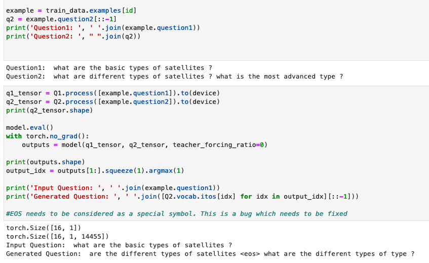

## Session 7: Assignment Part 1

### Objective: 
Sentiment Analysis using Stanford Sentiment Dataset (http://nlp.stanford.edu/~socherr/stanfordSentimentTreebank.zip) called as SST-5 where we will be performing sentiment analysis across 5 labels (Very Negative, Negative, Neutral, Positive, Very Positive) for movie reviews from Rotten Tomatoes. This dataset was curated by Stanford and using mTurks it was annotated at a phrase level i.e. Each sentence is represented as a Parse-Tree breaking it down into phrases. Each phrase was then shown to an annotator who gace it a score from 0 to 25, using a slider. This was later normalized to 0 to 1.

### About the Dataset

The SST5 dataset has ~12k sentences. Each sentence is further sub-divided into phrases and SST5 consists of  215,154 phrases each given a value from 0 to 1. And using these values we can map the probabilities as [0,0.2], (0.2, 0.4], (0.4, 0.6], (0.6, 0.8], (0.8, 1.0] for very negative, negative, neutral, positive, very positive, respectively.

### Preprocessing the Dataset

We will have to associate the sentiment value for every sentence in DatasetSentences.txt and map it to a Sentiment class.

Please refer [SST5 Preprocessing](SST5-Sentiment-Analysis/SST5_Preprocessing.ipynb)

The [readme.txt](dataset/stanfordSentimentTreebank/README.txt) talks about the different files in the dataset. The ones of note for us, are
- [datasetSentences.txt](dataset/stanfordSentimentTreebank/datasetSentences.txt)
- [sentiment_labels.txt](dataset/stanfordSentimentTreebank/sentiment_labels.txt)
- [dictionary.txt](dataset/stanfordSentimentTreebank/dictionary.txt)
- [datasetSplit.txt](dataset/stanfordSentimentTreebank/datasetSplit.txt)

Dataset Sentences contains 11,855 sentences. Dictionary maps each phrase to an ID. And Sentiment_Labels gives the label for each phrase. The Dictionary contains all the phrases of a given sentence and as seen below - The whole sentence is also a phrase. So we need to look up the sentence as a phrase in Dictionary, obtain the phrase ID associated with it and then look it up in Sentiment_Labels for its sentiment value which is given between 0 to 1

DatasetSplit, is later used to map Test and Train dataset after mapping sentiment values to the corresponding sentence 

**Example of sentence and its constituent phrases as given in the Dictionary.txt:**

A completely spooky piece of business|62875 \
A completely spooky piece of business that gets under your skin and , some plot blips aside|62876 \
A completely spooky piece of business that gets under your skin and , some plot blips aside ,|62877 \
A completely spooky piece of business that gets under your skin and , some plot blips aside , stays there for the duration .|62878

**Corresponding sentiment values for the phrases above, from sentiment_labels.txt**

62875|0.48611\
62876|0.68056\
62877|0.70833\
62878|0.65278

**Given a sentiment value, determining the sentiment class**  
[0,0.2], (0.2, 0.4], (0.4, 0.6], (0.6, 0.8], (0.8, 1.0] : very negative, negative, neutral, positive, very positive

62878|0.65278  
Sentiment Class for the sentence:  
*'A completely spooky piece of business that gets under your skin and , some plot blips aside , stays there for the duration .'*  
**POSITIVE**

#### Merging the Dataframes - Sentences with Phrases with Sentiment values using Inner Join

We do an inner join such that we link the sentence to a sentiment value based on its phrase_id. Each sentence is also a phrase. Hence we lookup the sentence in Dictionary and then obtain the sentiment value from sentiment_labels.txt

#### Splitting the Dataset

Based on the DatasetSplit.txt, we split the dataset into Train and Test as shown below:

## Loading the custom dataset

Please refer [SST5 Model Training](SST5-Sentiment-Analysis/SST5_ModelTraining.ipynb)

- We associate the data.Field and data.LabelField to Sentences and Sentiments. We use Spacy for tokenization of sentences.
- fields is a list of tuples that associate DataFrame columns to data.Field and data.LabelField
- data.Example shows how each record of the Dataset will be read from the DataFrames.
- We build the vocab based on the distinct number of non-repetitive Spacy tokens and store it in Pickle file
- We create BucketIterators such that it batches sentences of similar length with a batch size of 32.

## Model Architecture

- Using GLoVE embedding: We will be using GLoVe embeddings for better embeddings. We set the embedding lookup table weights to that of GLoVe's.

- This model has 5 stacked Bi-directional layers with a dropout of 0.65 between the layers. 

(IMO, this model is overparameterized)

## Training Log 

**The validation accuracy reached 42% but it did not increase further even after increasing the epochs**

## Model Results

### Confusion Matrix

(The model does not seem to predict Very_Positive labels correctly as seen below)

### Examples of correctly predicted sentences

### False Positives

False Positives - When a sentence has a negative sentiment but the model predicts Positive or Neutral as the sentiment is a False Positive.

## Session 7: Assignment Part 2

### Understanding Seq2Seq

Before we look at how we have used Seq2Seq for two datasets
- CMU Q and A
- Quora Duplicate questions dataset
Let us understand the crux of the code

**Encoder**: The Encoder here comprises of 2 LSTM layers stacked. nn.Embedding looks up the embedding for each token for all the sequences in a batch which is later sent to the encoder

**Decoder**: The Decoder here takes the initial <sos> token as the first input and the output of the encoder as the hidden layer for the first iteration. We can also send the target tokens as the subsequent input tokens for the decoder if we use teacher_forcing. Else, we can send the output of the decoder mapped to the higher predicted token as the input for the next step in the decoder. 

### CMU QnA Dataset

**Objective**: As part of Assignment 7 - Part 2, we will be using Q&A from the CMU Dataset to generate Answers based on the Questions from the Dataset. 

**Task**: For a given Question as input, using Seq2Seq generate an answer. We are using the model discussed in Session 7 of END2

### 1. Downloading and loading the dataset into DataFrames

#### About the dataset

This dataset was curated by CMU and Pitt Students from the period from 2008 - 2010.

There are three directories, corresponding to the yeats 2008, 2009 and 2010

In each of these three directories, there is a file "question_answer_pairs.txt" which contains the questions and answers. The columns in the TSV file are as follows:

**ArticleTitle**: Name of the Wikipedia article from which questions and answers initially came.  
**Question:** The Question  
**Answer :** The Answer  
**DifficultyFromQuestioner:** Prescribed difficulty rating for the question as given to the question-writer.  
**DifficultyFromAnswerer:** Difficulty rating assigned by the individual who evaluated and answered the question  
**ArticleFile:** Relative path to the prefix of the article files. html files (.htm) and cleaned text (.txt) files are provided.  

 

There are frequently multiple lines with the same question, which appear if those questions were answered by multiple individuals. 

#### Dataset after Preprocessing

We merge the "question_answer_pairs.txt" files from 2008 to 2010 and drop the questions with no answers. This is how the CMU QnA Dataset looks:

### Model Training 

For this task, we are looking at loss and not any accuracy metric. BLEU is a metric that we can use for accuracy when it comes to text generative models. Here is the training log

### Model Accuracy and Inference 

### Final Comments

Looks like the model is not doing well for complex questions which have Proper nouns and is able to answer yes/no kind of questions. Yes seems to be an answer it defaults too. Most of the proper nouns are <UNK> or unknown which can be rectified by using a better pre-trained embeddings and a better and bigger tokenizer from Spacy

## Similar Question Generation Using Quora Dataset with Seq2Seq Architecture

**Objective**: As part of Assignment 7 - Part 2, we will be using the Quora dataset which is a collection of question pairs and a field that shows whether they are duplicate questions. 

**Task**: For a given Question as input, using Seq2Seq generate a similar question. We are using the model discussed in Session 7 of END2

### 1. Downloading and loading the dataset into DataFrames

#### About the dataset

Called as the Quora First Dataset, this dataset was curated by the Quora team to identify similar questions and group them together. For example, the queries “What is the most populous state in the USA?” and “Which state in the United States has the most people?” should not exist separately on Quora because the intent behind both is identical. 

This dataset consists of over 400,000 lines of potential question duplicate pairs. Each line contains IDs for each question in the pair, the full text for each question, and a binary value that indicates whether the line truly contains a duplicate pair

We will be considering only duplicate question pairs for this exercise. Although the NLU task for this dataset is text similarity, we are using this dataset as a part of Assignment 7 Part 2 in END2 as a hands-on for using Seq2Seq architecture. 

**Input:** Question Q1  
**Output:** Question Q2  
where  
<Q1, Q2> are a pair of duplicate questions

#### Dataset after Preprocessing

### Dataset Split

### Tokenize and reverse

We reverse the target question since it was seen to give better results in the original paper which translated from English to German

### Model Training 

For this task, we are looking at loss and not any accuracy metric. BLEU is a metric that we can use for accuracy when it comes to text generative models. Here is the training log

### Model Accuracy and Inference 

### Generating similar questions

