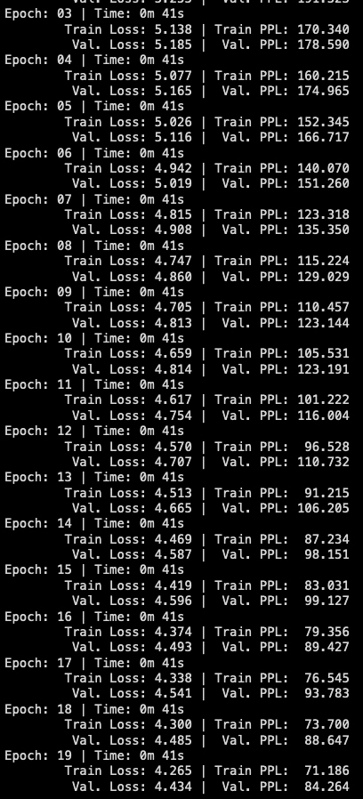
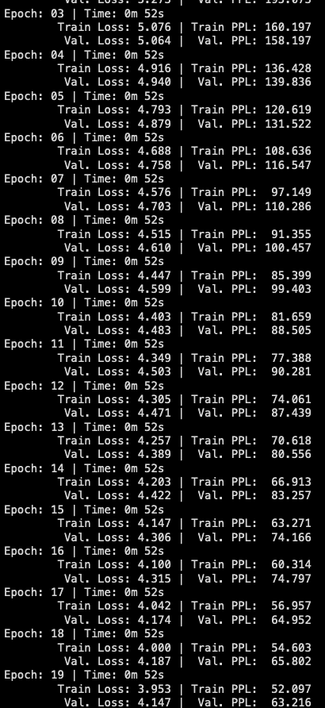
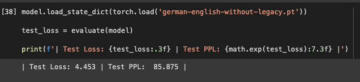
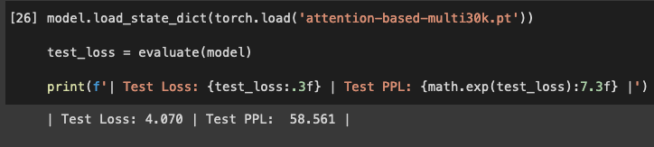

## Session 8: The Modern Text Processing Pipeline Using torchtext

We will be refactoring the notebooks from this [repo](https://github.com/bentrevett/pytorch-seq2seq) to better understand and implement torchtext's newer text processing pipeline. The objective here is to replace the torchtext.legacy functionality with the newer functionalities. We will be using Multi30k dataset and the task here is to translate English sentences to German sentences. 

The notebooks we will be working on are:
- [2 - Learning Phrase Representations using RNN Encoder-Decoder for Statistical Machine Translation.ipynb](https://github.com/bentrevett/pytorch-seq2seq/blob/master/2%20-%20Learning%20Phrase%20Representations%20using%20RNN%20Encoder-Decoder%20for%20Statistical%20Machine%20Translation.ipynb)
- [3 - Neural Machine Translation by Jointly Learning to Align and Translate.ipynb](https://github.com/bentrevett/pytorch-seq2seq/blob/master/3%20-%20Neural%20Machine%20Translation%20by%20Jointly%20Learning%20to%20Align%20and%20Translate.ipynb)

Colab Notebooks:
- https://colab.research.google.com/drive/1RL_csRqo7N930lGKHH9gkuwYoveWDVKb?usp=sharing
- https://colab.research.google.com/drive/1RifLWUgUb9LS5mM6yMIfyxSoWnSIHYiu?usp=sharing

**Please note:** For both the notebooks Data processing will be the same and the model architecture changes. We will also show the respective training logs and losses separately. But for clarity and brevity, we will be discussing both the notebooks in this document.


### Data Preprocessing

We load the Multi30k along with the train and test split using torchtext.datasets which includes a variety of datasets for different NLU and NLG tasks. 

We will be using this pipeline:\
Tokenize the sentences -> Build Vocabulary -> Collate the data i.e Numericalize tokens into tensor and apply other text preprocessing before it is sent for being trained

#### get_tokenizer

This is used to generate the tokenizer for the text i.e.to convert text into tokens (In our case we are asking it to use spacy as the library for tokenization)

It takes two arguments - tokenizer and the language of the text. 

If tokenizer is None, it splits the text based on spaces
If tokenizer is basic_english, it uses the inbuilt tokenizer for English
If tokenizer is a function, a custom function written by us to define the tokenization, it calls that function else if it is the name of the supported libraries of pytorch like spacy, then it used that library for tokenization

```
from torchtext.data.utils import get_tokenizer
token_transform[SRC_LANGUAGE] = get_tokenizer('spacy', language='de')
token_transform[TGT_LANGUAGE] = get_tokenizer('spacy', language='en')
```

#### build_vocab_from_iterator

This is used to build the vocabulary of the train and test sentences after tokenization. It takes in an iterator along with the other special tokens to be considered

The yield function, as defined below, can be seen as a state machine which remembers the pointer or index of a loop. When a yield function is called repeatedly, it points to the next location in the loop, based on an offset. 

```
# helper function to yield list of tokens
def yield_tokens(data_iter: Iterable, language: str) -> List[str]:
    language_index = {SRC_LANGUAGE: 0, TGT_LANGUAGE: 1}

    for data_sample in data_iter:
        yield token_transform[language](data_sample[language_index[language]])
```

The special tokens are 
- Unknown token <UNK>
- Padding token <PAD>
- Beginning of string <BOS>
- End of string <EOS>

We also assign token indixes for the above tokens and if we are naming it from 0, like how we have implemented below, we should also set ***special_first=True*** flag

```
# Define special symbols and indices
UNK_IDX, PAD_IDX, BOS_IDX, EOS_IDX = 0, 1, 2, 3
# Make sure the tokens are in order of their indices to properly insert them in vocab
special_symbols = ['<unk>', '<pad>', '<bos>', '<eos>']
```

Now, we can call the function for building the vocabulary. Multi30k dataset from torchtext also gives us an iterator based on the partition of the dataset we are going to be working on. ***build_vocab_from_iterator*** returns a Vocab object. In the case below, we have to create separate Vocab objects for German and English.

***vocab_transform***, given below is a dictionary that contains the vocab object with the language id as the key

```
for ln in [SRC_LANGUAGE, TGT_LANGUAGE]:
  # Training data Iterator 
  train_iter = Multi30k(split='train', language_pair=(SRC_LANGUAGE, TGT_LANGUAGE))
  # Create torchtext's Vocab object 
  vocab_transform[ln] = build_vocab_from_iterator(yield_tokens(train_iter, ln),
  min_freq=1,
  specials=special_symbols,
  special_first=True)
```

### Model Architecture

[2_Learning_Phrase_Representations_using_RNN_Encoder_Decoder_for_Statistical_Machine_Translation.ipynb](2_Learning_Phrase_Representations_using_RNN_Encoder_Decoder_for_Statistical_Machine_Translation.ipynb) uses GRU for the encoder whereas
[3_Neural_Machine_Translation_by_Jointly_Learning_to_Align_and_Translate.ipynb](3_Neural_Machine_Translation_by_Jointly_Learning_to_Align_and_Translate.ipynb) introduces an attention mechanism

```
encoder_outputs = encoder_outputs.permute(1, 0, 2)
        
#hidden = [batch size, src len, dec hid dim]
#encoder_outputs = [batch size, src len, enc hid dim * 2]
        
energy = torch.tanh(self.attn(torch.cat((hidden, encoder_outputs), dim = 2))) 
        
#energy = [batch size, src len, dec hid dim]

attention = self.v(energy).squeeze(2)
```

And the attention layer is defined as

```
self.attn = nn.Linear((enc_hid_dim * 2) + dec_hid_dim, dec_hid_dim)
self.v = nn.Linear(dec_hid_dim, 1, bias = False)
```


### Collation

Our data iterator from torchtext.datasets gives us a pair of strings - Each pair has a English sentence and a corresponding German sentence. But before sending it for training and for converting it into tensors, we need to do some transformations as part of our Data processing pipeline.

Let us relook at the tokenizaton and vocabulary building

When we define get_tokenizer, it generates **a tokenizer function** for us. And for build_vocab_from_iterator gets us a **vocab object** which is a dictionary that maps the tokens to its indices or ids

So we need to first apply the function from get_tokenizer for tokenization and then use that to get the token id from the vocab dictionary. Later we concatenate the sequence of token ids with beginning and end of string tokens. We can also perform other pre-processing like removing the new line from the text before sending it through this data processing pipeline. For ex: We can remove usernames from tweets in a Twitter or remove unwanted characters or convert it to Unicode for making the text cleaner to train on.

```
# src and tgt language text transforms to convert raw strings into tensors indices
text_transform = {}
for ln in [SRC_LANGUAGE, TGT_LANGUAGE]:
    text_transform[ln] = sequential_transforms(token_transform[ln], #Tokenization
    vocab_transform[ln], #Numericalization
    tensor_transform) # Add BOS/EOS and create tensor
```

Sequential_transforms takes a list of functions to be applied on a text. It is an interesting function that takes in a list of function and returns a function, as shown below.

Please also note that text_transform[ln] is a dictionary that points to the corresponding to tokenizer based on the language id given by ***ln***

```
# helper function to club together sequential operations
def sequential_transforms(*transforms):
    def func(txt_input):
        for transform in transforms:
            txt_input = transform(txt_input)
        return txt_input
    return func
```

It iterates through the list of functions given (ordering matters here) and applies it on the text. This inline function is defined and sent as a function. So text_transform points to a function that applies a list of functions (following the order in the list) on a text.

Let us also look at the tensor_transform function we adds a EOS and BOS token in this case.

```
# function to add BOS/EOS and create tensor for input sequence indices
def tensor_transform(token_ids: List[int]):
    return torch.cat((torch.tensor([BOS_IDX]), 
                      torch.tensor(token_ids), 
                      torch.tensor([EOS_IDX])))
```

Putting it all together in our collate function:

```

# function to collate data samples into batch tesors
def collate_fn(batch):
    src_batch, tgt_batch = [], []
    for src_sample, tgt_sample in batch:
        src_batch.append(text_transform[SRC_LANGUAGE](src_sample.rstrip("\n")))
        tgt_batch.append(text_transform[TGT_LANGUAGE](tgt_sample.rstrip("\n")))

    src_batch = pad_sequence(src_batch, padding_value=PAD_IDX)
    tgt_batch = pad_sequence(tgt_batch, padding_value=PAD_IDX)
    return src_batch, tgt_batch
```

text_transform returns a function that is applied to a text for which the newline character has been removed using ***rstrip***

### Model Training 

Training Log for
[2_Learning_Phrase_Representations_using_RNN_Encoder_Decoder_for_Statistical_Machine_Translation.ipynb](2_Learning_Phrase_Representations_using_RNN_Encoder_Decoder_for_Statistical_Machine_Translation.ipynb)

 

Training Log for
[3_Neural_Machine_Translation_by_Jointly_Learning_to_Align_and_Translate.ipynb](3_Neural_Machine_Translation_by_Jointly_Learning_to_Align_and_Translate.ipynb)


 

### Model Evaluation

Test Loss for
[2_Learning_Phrase_Representations_using_RNN_Encoder_Decoder_for_Statistical_Machine_Translation.ipynb](2_Learning_Phrase_Representations_using_RNN_Encoder_Decoder_for_Statistical_Machine_Translation.ipynb)

 

Test Loss for
[3_Neural_Machine_Translation_by_Jointly_Learning_to_Align_and_Translate.ipynb](3_Neural_Machine_Translation_by_Jointly_Learning_to_Align_and_Translate.ipynb)

 
    
### Weights 
    
Please find the weights for the models trained here : 
    - https://drive.google.com/file/d/1noCUtqVywlJ0XFsDZfWReUOjJlGvsTRu/view?usp=sharing
    - https://drive.google.com/file/d/1SruLLc3CixKRanO-ffYrOymf37Dam0C8/view?usp=sharing
